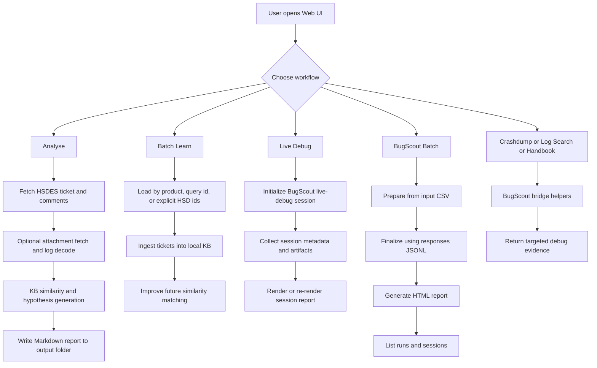
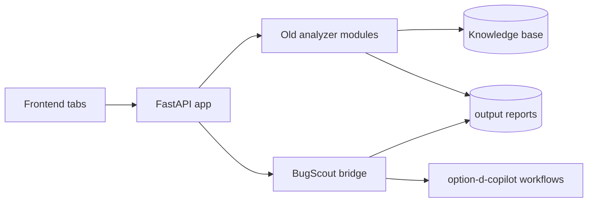

# Auto HSD Analyser (Server Platforms)

An **agentic HSD-ES triage assistant** for Intel server platforms. Give it an **HSD ID**
and it will:

1. **Read** the ticket fully from HSDES (title, description, and the whole comment thread),
2. **Compare** it against a self-learning Knowledge Base seeded from your product master
   queries (GNR / SRF / CWF today; DMR / COR ready to add),
3. **Report** a structured triage: summary, similar past issues **with their root cause and
   how they were resolved**, ranked hypotheses, and **domain-specific next steps + PythonSV
   commands**,
4. **Learn** — every ticket it sees is written back into the KB, so it gets smarter over time.

> Status: **validated live against real HSDES** using Intel Kerberos SSO (no password, no
> token). Works for any teammate on the Intel network/domain.

Scope: **any server-platform domain** — RAS/MCA, UPI/coherency, memory, PCIe/CXL,
power/S-states, BIOS/IFWI/BMC/boot-hang, OS/driver. Not tied to any single unit.

---

## Prerequisites (each user, one-time)

- **Windows on the Intel domain** (so Kerberos SSO to HSDES works with your existing login)
- **Python 3.10+** (`python --version`)
- Network access to `https://hsdes-api.intel.com`
- (Optional) an OpenAI-compatible LLM endpoint for full prose reasoning — the tool works
  fully without it in deterministic "offline" mode.

No HSDES token or password is needed — it authenticates as **you** via Kerberos.

---

## Quick start (5 minutes)

Use this if you only want the fastest path to run the hybrid tool.

1. Open PowerShell in the project folder.
2. Allow script execution for the current shell.
3. Run the launcher.
4. Open the web UI and start analyzing.

```powershell
cd "C:\Users\rbalaji\OneDrive - Intel Corporation\Documents\Intel\projects_GHCP\Auto_HSD_analyser_RDT and UPI"
Set-ExecutionPolicy -Scope Process -ExecutionPolicy RemoteSigned
./run.ps1
```

Open: **http://127.0.0.1:8000**

First actions in UI:
- Analyse tab: run one HSD ID + symptom.
- Batch Learn tab: seed KB from product/query/ids.
- BugScout Batch tab: run `prepare -> finalize -> report`.

Stop the server with `Ctrl+C` in the terminal.

---

## Single powerful tool (merged root + OptionD)

To avoid split workflows across folders, use one unified entrypoint:

```powershell
./run_power_tool.ps1 <command>
```

Equivalent Python entrypoint:

```powershell
python -m app.power_tool <command>
```

### What is merged now
- Root app workflows: web UI, HSD analyze, batch learn, KB, product APIs.
- BugScout bridge workflows: crashdump, handbook RAG, log index/search/cache.
- OptionD triage pipeline modes: prepare, finalize, report, live-debug, crashdump.
- OptionD utility scripts: patch_fields, write_single_response, write_batch_responses, QAT r2v2 report generation, UI mode launcher.
- Run/session discovery: list batch run folders and live-debug sessions from one command.

### High-value commands
```powershell
# 1) Start unified web app
./run_power_tool.ps1 serve --reload

# 2) One-shot HSD markdown analysis
./run_power_tool.ps1 summarize 16030948515 "UPI degradation hang"

# 3) Batch learn from product/query/ids
./run_power_tool.ps1 batch-learn --product GNR --limit 50
./run_power_tool.ps1 batch-learn --query-id <saved_query_id> --limit 100
./run_power_tool.ps1 batch-learn --ids 16030948515 22022875184

# 4) OptionD prepare/finalize/report pipeline
./run_power_tool.ps1 optiond prepare --input C:\path\to\input.csv
./run_power_tool.ps1 optiond finalize --responses C:\path\to\responses.jsonl --output-dir C:\path\to\run_out
./run_power_tool.ps1 optiond report --input C:\path\to\triage_results.csv --output-dir C:\path\to\run_out

# 5) Live debug and report regeneration path
./run_power_tool.ps1 optiond live-debug --hsd-id 14027419708 --execution-mode manual

# 6) Existing OptionD utilities from same entrypoint
./run_power_tool.ps1 optiond patch-fields --identify
./run_power_tool.ps1 optiond patch-fields --all
./run_power_tool.ps1 optiond write-single
./run_power_tool.ps1 optiond write-batch
./run_power_tool.ps1 optiond qat-r2v2-report
./run_power_tool.ps1 optiond ui-mode

# 7) Inventory runs/sessions
./run_power_tool.ps1 optiond runs --limit 30
```

---

## Unified smoke test (one command)

Run a fast PASS/FAIL validation for the merged tool surface:

```powershell
./tools/smoke_unified.ps1
```

Direct Python equivalent:

```powershell
python .\tools\smoke_unified.py
```

What it validates:
- Unified CLI help wiring (`app.power_tool` and `optiond` subcommands)
- Read-only API endpoints (`health`, `products`, `features`, `runs`, `kb`)
- Required-field validation behavior on key POST routes

Exit codes:
- `0` = all checks passed
- `1` = one or more checks failed

---

## How to share this with your team

The whole tool is this folder. Share it any of these ways:

### Option 1 — Zip and send (simplest)
From the project's parent folder:
```powershell
# Exclude local/regenerated files so the zip stays small and clean
$exclude = @('.venv','kb\*.sqlite','.env','__pycache__')
Compress-Archive -Path '.\Auto_HSD_analyser_RDT and UPI\*' -DestinationPath '.\AutoHSDAnalyser.zip' -Force
```
Send `AutoHSDAnalyser.zip`. The recipient unzips it anywhere and follows **Setup & run** below.
(The `.venv`, `.env`, and `kb/*.sqlite` are per-machine and are recreated automatically.)

### Option 2 — Internal Git (best for updates)
Push to Intel Innersource / any internal Git, then teammates clone:
```powershell
git clone <internal-repo-url> auto-hsd-analyser
```
(See `docs/SHARING.md` for the exact publish steps.)

### Option 3 — Shared drive
Copy the folder to a shared location. Each user copies it **locally** before running
(don't run from the share, so each person gets their own `.venv`/`.env`/KB).

> Never commit or share `.env` or `kb/*.sqlite` — they're per-user and already git-ignored.

---

## Setup & run (Windows PowerShell)

```powershell
cd "auto-hsd-analyser"        # the folder you copied/cloned
./run.ps1
```
`run.ps1` will, on first run:
- create a virtual environment (`.venv`),
- install dependencies (incl. `requests-kerberos` for SSO),
- create `.env` from the template (defaults to `HSDES_AUTH_MODE=auto` — Kerberos),
- start the web app at **http://127.0.0.1:8000**.

If PowerShell blocks the script the first time:
```powershell
Set-ExecutionPolicy -Scope Process -ExecutionPolicy RemoteSigned
```

Then open **http://127.0.0.1:8000**, type an **HSD ID** + a short **symptom** line, and
click **Analyse**.

---

## Sample run walkthrough (end to end)

This is a concrete example for a first-time run.

### 1) Start the app
```powershell
cd "C:\Users\rbalaji\OneDrive - Intel Corporation\Documents\Intel\projects_GHCP\Auto_HSD_analyser_RDT and UPI"
Set-ExecutionPolicy -Scope Process -ExecutionPolicy RemoteSigned
./run.ps1
```

Open **http://127.0.0.1:8000**.

### 2) Run one analysis from the UI
In the **Analyse** tab, enter:
- HSD ID: `16030948515`
- Symptoms: `2S GNR AP hangs after UPI degradation and port disable; AP check-in not complete`

Optional:
- Tick **Auto-fetch attachments** to decode logs attached to the ticket.
- Paste extra serial/PythonSV log text in **Attached log**.

Click **Analyse**.

Expected result:
- A structured RCA response is shown in the UI.
- A markdown report is saved under `output\` with a timestamped name.

### 3) Confirm saved report on disk
```powershell
Get-ChildItem .\output\hsd_16030948515_*.md | Sort-Object LastWriteTime -Descending | Select-Object -First 1 FullName, LastWriteTime
```

### 4) Run hybrid BugScout batch flow from UI
Open **BugScout Batch** tab and run in this order:
1. **Prepare**: provide `input_csv` path.
2. **Finalize**: provide `responses_jsonl` path.
3. **Report**: provide `input_csv` (and optional run output path).

Expected result:
- Prepare/finalize/report command outputs are shown in the panel.
- Generated HTML report appears under the selected run/output directory.

### 5) Refresh session inventory
Use **Refresh Runs** in **BugScout Batch** to list discovered run folders and live-debug sessions.

---

## Where your analysis is saved

**Every** analysis — whether run from the web UI or the command line — is saved as both
**Markdown and HTML** files in the **`output\`** folder inside the project:

```
<project>\output\hsd_<HSD_ID>_<YYYYMMDD_HHMMSS>.md
<project>\output\hsd_<HSD_ID>_<YYYYMMDD_HHMMSS>.html
```

Example: `output\hsd_16030948515_20260720_143512.md`
Example: `output\hsd_16030948515_20260720_143512.html`

- The web UI returns `saved_path` (markdown) and `saved_html_path` (HTML) after each run.
- The CLI (`python -m app.summarize`) prints both saved artifact paths at the end.
- Files are timestamped, so re-analysing the same HSD keeps every version.
- `output\` is git-ignored (reports may contain HSD data) — it stays on your machine.

To open the folder quickly:
```powershell
explorer .\output          # or:  Get-ChildItem .\output\*.md
```

---

## Using it

### Web UI
- **Analyse tab** — enter HSD ID + symptoms → full A–H report.
- **Batch Learn tab** — seed/update the old tool KB using product, query id, or explicit HSD IDs.
- **Live Debug tab** — initialize BugScout live-debug sessions and render session reports from session id.
- **BugScout Batch tab** — run `prepare -> finalize -> report` pipeline directly from UI paths.
- **Crashdump / Log Search / Handbook RAG tabs** — BugScout-derived workflows in-app.
- **Knowledge Base tab** — browse everything the tool has learned.

### Seed the Knowledge Base from your master queries (recommended)
The more it has learned, the better the "similar issues" comparison. Seed per product:
```powershell
python -m app.batch_learn --product GNR      # learns all GNR master-query tickets
python -m app.batch_learn --product SRF
python -m app.batch_learn --product CWF
python -m app.batch_learn --ids 16030948515 22022875184   # or specific IDs
```

### Command line (no browser)
```powershell
python -m app.summarize 16030948515                 # analyze + save report to output/
python -m app.summarize 14028261445 --log serial.log  # also scan an attached log

# same via unified wrapper
python -m app.power_tool summarize 16030948515
```

### Analyze attached logs
Paste a log (serial / PythonSV / BMC SEL / OS kernel / RPT) into the **Attached log** box
in the UI, or pass `--log <file>` on the CLI. The tool scans it for MCE/CATERR/IERR,
UPI/DDR/PCIe, boot-hang, and OS-panic signatures and adds an **"A2. Attached log
analysis"** section (severity-ranked, with the last POST checkpoint and **MCA decode** —
MCi_STATUS → flags/MCACOD/MSCOD) that feeds the root-cause hypotheses and next steps.

### Log-first accuracy mode (default)
The analyzer now follows a built-in staged flow automatically (no extra switches):

1. Check known KB matches first.
2. Analyze current HSD attached logs and decoded evidence.
3. Expand to clone/similar/transferred context only if KB + local evidence are not strong enough.

This keeps token usage low while preserving accuracy.

### Auto-fetch the logs already on the ticket
Tick **"Auto-fetch attachments"** in the UI, or pass `--fetch-attachments` on the CLI:
```powershell
python -m app.summarize 16030948515 --fetch-attachments
```
The tool downloads the ticket's attached resources (zip/gz/text) from HSDES, extracts the
logs, and analyzes them automatically — no manual download needed.

### Sync findings from a transferred sub-team ticket
When a platform sighting is **transferred** to a sub-team (pcode / BIOS / Ocode / S3M /
Linux / BMC / Xucode), the root cause and fix land on the *sub-team* ticket — not on your
sighting. The tool detects that transferred-to HSD from the description/comments, pulls its
latest **root cause, fix ingredient/revision, status, and any new Axon recordings**, and adds
a **"🔁 Transferred-Ticket Sync"** section with a **ready-to-post "Update from Transferred
Ticket" comment** you can review and paste back on the sighting (the tool never auto-posts).
This runs by default; disable it with `--no-transferred`:
```powershell
python -m app.summarize 16030948515                 # includes transferred-ticket sync
python -m app.summarize 16030948515 --no-transferred  # skip the sub-team lookup
```

### Report format — structured Root-Cause-Analysis
Every report is written as a formal **RCA memo** with these sections: a metadata header
(date / platform / component / status / owner), **Artifacts Under Analysis**, **Findings
Summary**, **Analysis Methodology**, **Root Cause** (primary + ranked alternatives, each tied
to evidence), **Secondary Observations**, and a numbered **Recommended Fix** ending in an
explicit **Expected result** line — followed by a collapsible **Appendix** with the full
evidence (narrative, log analysis, KB matches, similar HSDs, knowledge pack, Axon). In LLM
mode the same structure is produced with full prose; in OFFLINE mode it is deterministic.

### Query Geni + Co-Design HSDES together (optional MCP enrichment)
The tool can additionally query the internal **Geni HSDES** and **Co-Design HSDES** agent
gateways over MCP and fold their answers into the ticket context, so a report is grounded in
**HSDES REST + Geni + Co-Design** at once. It's off by default; enable per source by setting
its URL + token in `.env`:
```env
GENI_MCP_URL=https://<geni-mcp-gateway>/mcp
GENI_MCP_TOKEN=<your-bearer-token>
CODESIGN_MCP_URL=https://<codesign-mcp-gateway>/mcp
CODESIGN_MCP_TOKEN=<your-bearer-token>
```
When configured, the "Artifacts Under Analysis" and "Analysis Methodology" sections note
which external sources were queried. (Inside VS Code Copilot chat, these same Geni and
Co-Design plugins can be orchestrated directly — no configuration needed.)

### HTTP API (for automation)
| Method | Route | Purpose |
|--------|-------|---------|
| `POST` | `/api/analyze` | `{ "hsd_id": "...", "symptoms": "..." }` → full result |
| `POST` | `/api/batch_learn` | `{ "product": "GNR" }` or `{ "query_id": "..." }` or `{ "hsd_ids": [...] }` |
| `GET`  | `/api/kb` | list learned cases |
| `GET`  | `/api/products` | list products + their master queries |
| `GET`  | `/api/health` | auth mode / KB size |
| `GET`  | `/api/bugscout/features` | bridge capability status |
| `POST` | `/api/bugscout/live-debug-init` | bootstrap live-debug session init metadata |
| `POST` | `/api/bugscout/live-debug-report` | regenerate reports for an existing session id |
| `POST` | `/api/bugscout/crashdump` | parse crashdump file via BugScout router |
| `POST` | `/api/bugscout/log-index` | index a large log file for targeted search |
| `POST` | `/api/bugscout/log-search` | query indexed logs by keyword/section |
| `GET`  | `/api/bugscout/log-cache` | list indexed log cache entries |
| `POST` | `/api/bugscout/handbook-search` | retrieve handbook snippets for a debug query |
| `POST` | `/api/bugscout/batch-prepare` | run parse_and_triage prepare mode |
| `POST` | `/api/bugscout/batch-finalize` | run parse_and_triage finalize mode |
| `POST` | `/api/bugscout/batch-report` | run parse_and_triage report mode |
| `GET`  | `/api/bugscout/runs` | list BugScout run folders and live-debug sessions |

### API quick-test playbook (PowerShell + optional curl)

Use this section to quickly validate that all key endpoints are healthy and wired.

#### A) Set base URL once
```powershell
$base = "http://127.0.0.1:8000"
```

#### B) Basic GET checks
```powershell
Invoke-RestMethod "$base/api/health"
Invoke-RestMethod "$base/api/products"
Invoke-RestMethod "$base/api/bugscout/features"
Invoke-RestMethod "$base/api/bugscout/runs"
Invoke-RestMethod "$base/api/kb"
```

#### C) Core analyzer: analyze one HSD
```powershell
$body = @{
  hsd_id = "16030948515"
  symptoms = "2S GNR AP hangs after UPI degradation and port disable"
  fetch_attachments = $true
} | ConvertTo-Json

Invoke-RestMethod -Method Post -Uri "$base/api/analyze" -ContentType "application/json" -Body $body
```

#### D) Old-tool batch learn (three common modes)
```powershell
# Mode 1: by product
$bl1 = @{ product = "GNR"; limit = 25 } | ConvertTo-Json
Invoke-RestMethod -Method Post -Uri "$base/api/batch_learn" -ContentType "application/json" -Body $bl1

# Mode 2: by explicit HSD IDs
$bl2 = @{ hsd_ids = @("16030948515", "22022875184"); limit = 50 } | ConvertTo-Json
Invoke-RestMethod -Method Post -Uri "$base/api/batch_learn" -ContentType "application/json" -Body $bl2

# Mode 3: by saved query id
$bl3 = @{ query_id = "<your_saved_query_id>"; limit = 100 } | ConvertTo-Json
Invoke-RestMethod -Method Post -Uri "$base/api/batch_learn" -ContentType "application/json" -Body $bl3
```

#### E) BugScout live debug endpoints
```powershell
# Initialize live-debug session metadata
$liveInit = @{
  hsd_id = "16030948515"
  execution_mode = "manual"
  server = ""
  ssh_user = ""
  max_iterations = 10
  initial_logs_json = $null
} | ConvertTo-Json

Invoke-RestMethod -Method Post -Uri "$base/api/bugscout/live-debug-init" -ContentType "application/json" -Body $liveInit

# Re-render an existing live-debug report from session id
$liveReport = @{ session_id = "<session_id_from_previous_run>" } | ConvertTo-Json
Invoke-RestMethod -Method Post -Uri "$base/api/bugscout/live-debug-report" -ContentType "application/json" -Body $liveReport
```

#### F) BugScout batch pipeline (prepare -> finalize -> report)
```powershell
# 1) Prepare
$prepare = @{ input_csv = "C:\path\to\input.csv" } | ConvertTo-Json
Invoke-RestMethod -Method Post -Uri "$base/api/bugscout/batch-prepare" -ContentType "application/json" -Body $prepare

# 2) Finalize
$finalize = @{
  responses_jsonl = "C:\path\to\responses.jsonl"
  output_dir = "C:\path\to\run_output"
} | ConvertTo-Json
Invoke-RestMethod -Method Post -Uri "$base/api/bugscout/batch-finalize" -ContentType "application/json" -Body $finalize

# 3) Report
$report = @{
  input_csv = "C:\path\to\input.csv"
  output_dir = "C:\path\to\run_output"
} | ConvertTo-Json
Invoke-RestMethod -Method Post -Uri "$base/api/bugscout/batch-report" -ContentType "application/json" -Body $report
```

#### G) BugScout crashdump/log/handbook helpers
```powershell
# Crashdump parse
$crash = @{ input_path = "C:\path\to\crashdump.json"; output_dir = "C:\path\to\decode_out" } | ConvertTo-Json
Invoke-RestMethod -Method Post -Uri "$base/api/bugscout/crashdump" -ContentType "application/json" -Body $crash

# Log index
$index = @{ file_path = "C:\path\to\large.log" } | ConvertTo-Json
Invoke-RestMethod -Method Post -Uri "$base/api/bugscout/log-index" -ContentType "application/json" -Body $index

# Log search
$search = @{
  file_path = "C:\path\to\large.log"
  keywords = @("CATERR", "IERR", "MCA")
  lines = 80
  section = $null
} | ConvertTo-Json
Invoke-RestMethod -Method Post -Uri "$base/api/bugscout/log-search" -ContentType "application/json" -Body $search

# Log cache list
Invoke-RestMethod "$base/api/bugscout/log-cache"

# Handbook retrieval
$handbook = @{ query = "UPI degradation during AP check-in"; top_k = 4 } | ConvertTo-Json
Invoke-RestMethod -Method Post -Uri "$base/api/bugscout/handbook-search" -ContentType "application/json" -Body $handbook
```

#### H) Optional curl equivalents
Use `curl.exe` in Windows PowerShell to avoid alias behavior:
```powershell
curl.exe -s "$base/api/health"
curl.exe -s -X POST "$base/api/bugscout/batch-prepare" -H "Content-Type: application/json" -d "{\"input_csv\":\"C:\\\\path\\\\to\\\\input.csv\"}"
```

#### I) Quick pass/fail expectations
- `GET` endpoints should return `200` with JSON.
- `POST` endpoints should return `200` for valid payloads.
- Missing required fields should return `400` with a clear error message.
- File-based endpoints may fail with `400` if paths do not exist or are unreadable.

---

## Flow chart (hybrid old tool + BugScout)





---

## Adding a product (e.g. DMR, COR)

Edit [app/products.json](app/products.json) — add the product's aliases, families, and the
saved **HSDES query id(s)**. No code change needed:
```jsonc
"DMR": {
  "display": "Diamond Rapids",
  "aliases": ["DMR", "Diamond Rapids"],
  "master_queries": ["<saved-query-id>"]
}
```

Current registry: **GNR** (2 queries), **SRF** (2), **CWF** (5), **DMR/COR** (placeholders).

---

## Optional: full LLM reasoning

Set these in `.env` to turn the deterministic report into full prose root-cause analysis:
```
LLM_BASE_URL=<openai-compatible endpoint>
LLM_API_KEY=<key>
LLM_MODEL=gpt-4o
```
Without them, the tool runs in **offline mode** (deterministic, still fully useful).

---

## Troubleshooting

| Symptom | Fix |
|---------|-----|
| `run.ps1` blocked | `Set-ExecutionPolicy -Scope Process -ExecutionPolicy RemoteSigned` |
| Auth/401 to HSDES | Ensure you're on the Intel domain and logged in; confirm `HSDES_AUTH_MODE=auto` in `.env` |
| `requests-kerberos` install fails | `pip install requests-kerberos` inside `.venv`; ensure Windows/Intel domain |
| Empty analysis / no ticket data | Check network to `hsdes-api.intel.com`; try the ID in a browser first |
| Query returns 0 tickets | The saved query may be in a scope your account can't read; try `--ids` directly |

---

## Notes
- **Intel Internal Use Only.** Do not commit `.env`, `kb/*.sqlite`, or raw silicon logs.
- An **SSO-hosted variant** (one shared web app, per-user Intel SSO) lives in `option-c-sso/`
  and will be finished later.
- A **VS Code Copilot prompt** version is in `option-d-copilot/` for those who prefer to run
  it inside GitHub Copilot chat.
