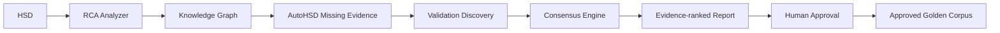

# Agent Workflow Diagram

```mermaid
flowchart LR
  HSD --> RCA[RCA Analyzer]
  RCA --> KG[Knowledge Graph]
  KG --> AUTO[AutoHSD Missing Evidence]
  AUTO --> VAL[Validation Discovery]
  VAL --> CONS[Consensus Engine]
  CONS --> REPORT[Evidence-ranked Report]
  REPORT --> HUMAN[Human Approval]
  HUMAN --> GOLD[Approved Golden Corpus]
```

Every arrow carries provenance and confidence metadata. A contradiction,
unknown platform, decoder ambiguity, or unknown source blocks automatic
promotion.
