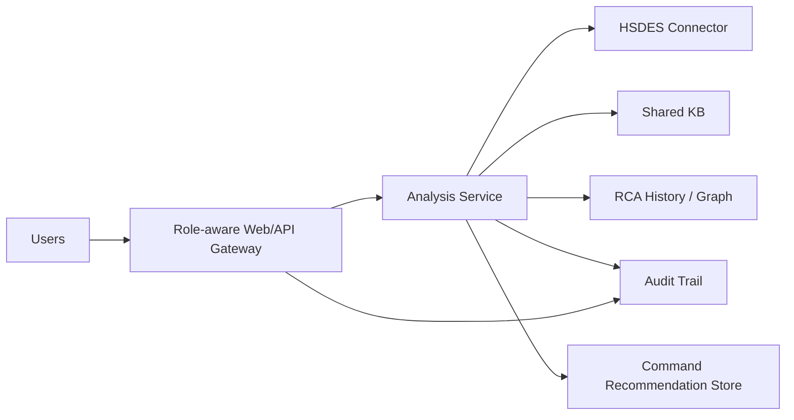

# NEXUS Shared VM Deployment Architecture

Planning artifact only. No production deployment is authorized by this document.

## Logical Components

## Deployment Shape

- Shared Linux or Windows VM behind Intel network controls.
- FastAPI service behind an authenticated reverse proxy.
- PostgreSQL or equivalent shared metadata store for KB, RCA history, and audit events.
- Object storage for immutable reports and attachments metadata.
- HSDES Kerberos/SSPI or approved service identity; no passwords in source.
- Git integration through protected repository credentials or a service account.
- No automatic command execution on SUTs; AutoHSD output remains recommendation-only until separately approved.

## Security Boundaries

- Read-only HSDES access by default.
- Separate write-back role with explicit approval and audit record.
- No shell execution role in the analysis service.
- Per-user audit identity on every analysis, recommendation, approval, and export.
- Tenant/platform data isolation where required.
