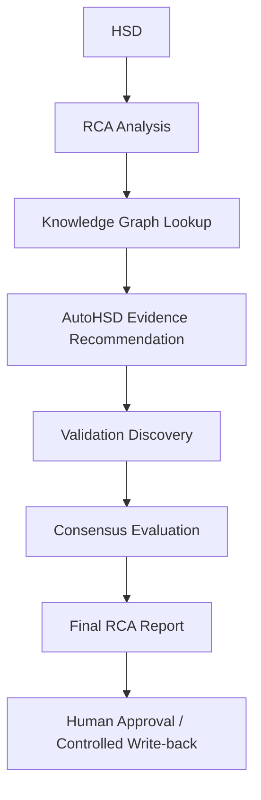

# NEXUS Enterprise Agent Design

Planning artifact only.

## Agent Boundaries

- RCA analysis decodes current machine evidence.
- Knowledge graph supplies historical context, never automatic proof.
- AutoHSD identifies missing artifacts and generates commands only.
- Validation discovery labels evidence provenance and validation level.
- Consensus ranks related cases and exposes disagreement.
- Human approval is required for Golden Case promotion and write-back.

## Non-goals

- No autonomous shell execution.
- No automatic Golden Case creation.
- No claim/comment promotion to authoritative RCA.
