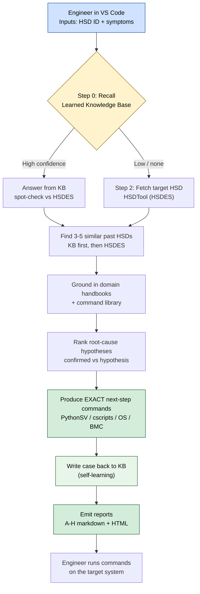
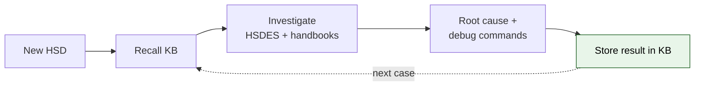

# Auto HSD Analyser — Management Overview

**One line:** An engineer opens VS Code, enters an HSD ID and a few symptom words, and
GitHub Copilot returns a triage report with likely root cause and the **exact commands**
to collect the next debug data — using each engineer's own Intel access, with nothing to
deploy or share.

---

## Why it matters

| Today (manual triage) | With Auto HSD Analyser |
|---|---|
| Engineer searches HSDES, wikis, and past tickets by hand | Tool recalls similar cases + HSDES automatically |
| Debug knowledge lives in people's heads | Knowledge is captured in a self-learning KB and handbooks |
| "Collect more logs" — vague next steps | Exact PythonSV / OS / BMC commands to run next |
| Every engineer starts from scratch | Each solved case makes the next one faster |
| Needs a hosted service + shared credentials | Runs locally in Copilot, per-user auth, zero shared token |

---

## How it works (flow)

---

## The self-learning loop (why it gets better over time)

Each resolved case is stored, so future tickets with the same signature are answered
faster and with higher confidence — without re-querying everything from scratch.

---

## What it produces

For any HSD, the engineer receives:
- **Target HSD summary** — title, component/domain, stepping, status, owner
- **Similar past HSDs** — top 3-5 with root cause and status
- **Ranked root-cause hypotheses** — each marked *confirmed* or *hypothesis*
- **Exact next-step commands** — copy-paste debug commands per domain
- **HTML + markdown report** — shareable artifact saved locally

---

## Deployment & security posture

- Runs **inside each engineer's VS Code** with GitHub Copilot.
- Uses **each person's own Intel MCP authentication** — no shared token, no server.
- HSDES / KB queries happen **as that user**, respecting their existing access.
- To onboard a teammate: install Copilot + the Intel MCP plugin, drop in the prompt, run.

---

## Current status (2026-08-10)

| Area | Status |
|---|---|
| Prompt workflow (primary product) | Ready for guided demos |
| Bundled skills (triage, handbook, log-search, live-debug, crash-parser) | Present |
| Seeded knowledge (UPI/RDT example HSD 16030948515) | Present |
| Optional Python engine (batch + local reports) | Smoke-tested; report paths repaired |

*Intel Internal Use Only.*
